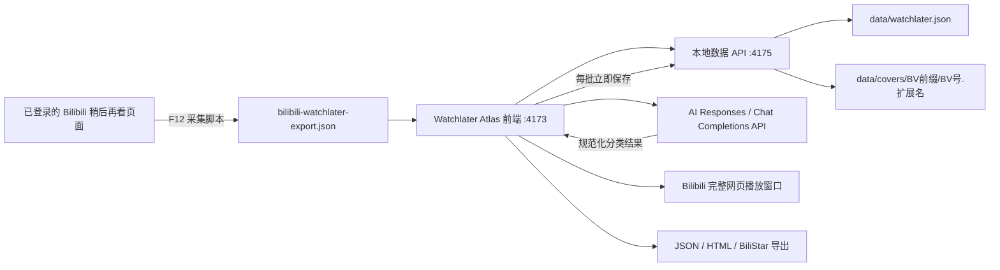
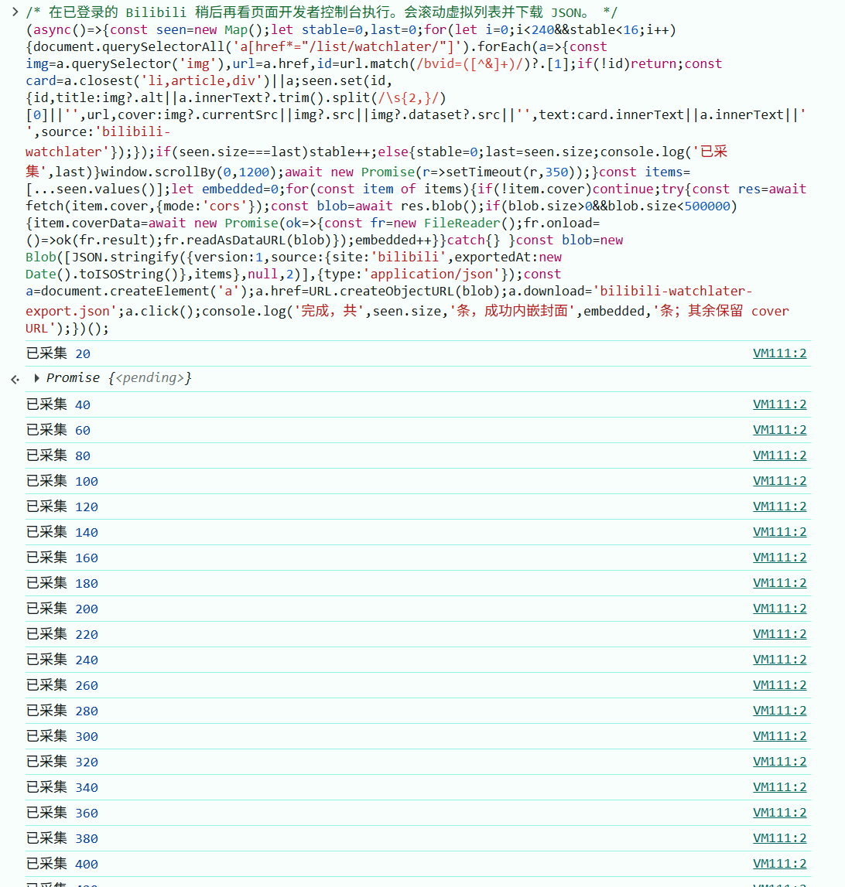
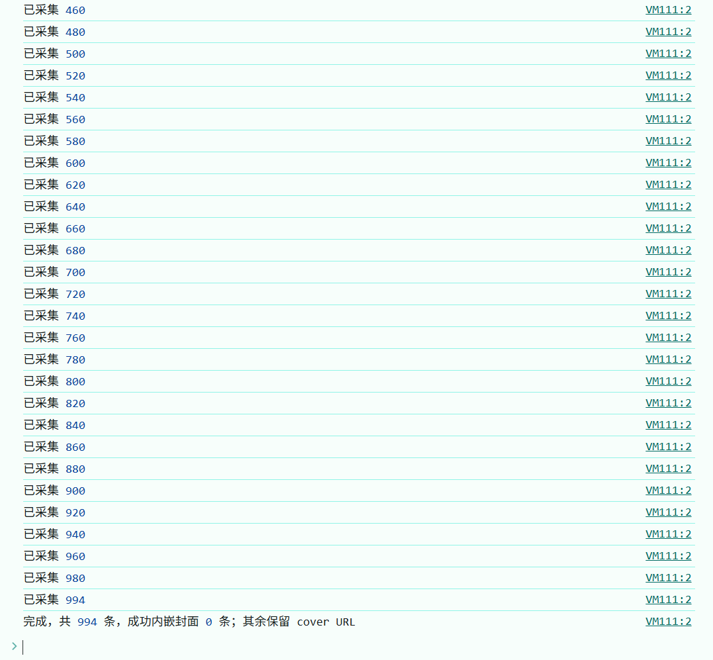
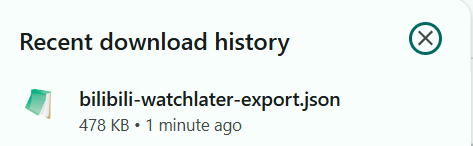
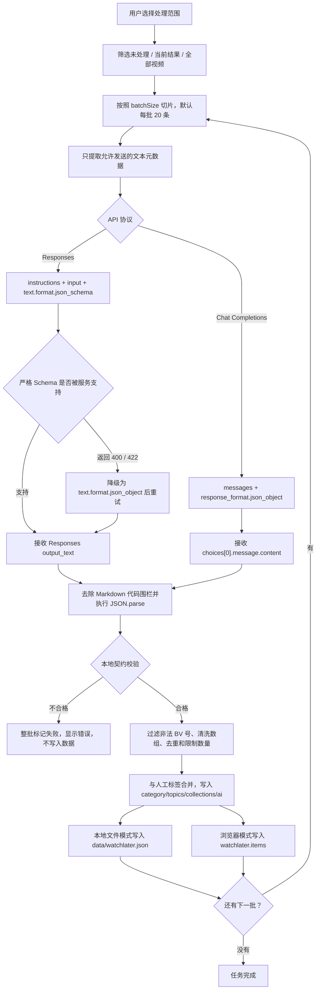

# Watchlater Atlas

这是一个面向重度 Bilibili 用户的本地稍后再看资料库。它把原站只有一个长列表的“稍后再看”，转换成可搜索、可编辑、可分类、可归档、可写备注、可由 AI 辅助整理，并且可以长期保存在本地文件中的视频数据集。

Watchlater Atlas 不下载视频文件本身。它保存视频在列表页能够取得的元数据、原站 CDN 封面地址和本地化封面，并提供完整 Bilibili 网页窗口用于正常登录播放。需要管理已经下载到本地的视频文件时，可以把资料导出到配套的 BiliStar Video 项目。

## 项目解决的问题

Bilibili 稍后再看适合临时保存少量视频，但当列表增长到几百或上千条后，会出现以下问题：

- 所有视频挤在一个列表里，缺少分类、标签、收藏夹和个人备注。
- 搜索和重复整理效率较低，难以形成长期维护的资料库。
- 列表容量和账号状态受原站约束，无法作为稳定的个人数据存档。
- 封面传递了大量视觉信息，但普通链接导出通常没有本地封面文件。
- 一次渲染近千张卡片和图片会造成明显的 DOM、图片解码和内存压力。
- 使用 AI 分类时，整库一次发送容易超过模型上下文，而且失败过程难以观察和恢复。

Watchlater Atlas 将这些职责拆分为采集、导入、封面本地化、人工整理、AI 分类、播放和导出几个可独立控制的阶段。

## 核心能力

| 能力 | 说明 |
| --- | --- |
| 登录态采集 | 采集代码直接运行在已经登录的 Bilibili 稍后再看页面中，不读取或导出 Cookie |
| 元数据契约 | 使用 `bili-library/v2` 保存 BV 号、标题、作者、播放量、观看进度、标签、分类、备注和 AI 记录 |
| 封面双来源 | 同时保留原站 `coverOriginal` 和本地 `coverFile`，可在页面中切换 |
| 本地持久化 | 主模式写入 `data/watchlater.json` 和 `data/covers`，不依赖浏览器缓存 |
| 浏览器模式 | 可选择使用 localStorage，适合临时使用或纯浏览器数据迁移 |
| 大规模浏览 | 默认使用窗口级虚拟无限滚动，只挂载视口附近的卡片；也可切换顶部固定分页 |
| 人工整理 | 支持标签、主分类、主题、收藏夹、状态、个人备注、归档、删除和手动新增 |
| AI 分类 | 支持 Responses API 和 Chat Completions，按批处理、严格校验、逐批保存、暂停和停止 |
| 完整网页播放 | 使用复用登录 Cookie 的真实 Bilibili 顶层窗口，不使用受限 iframe 播放器 |
| 可移植导出 | 支持 JSON、CDN HTML、内嵌封面 HTML，以及导出到 BiliStar Video |

## 整体架构



采集脚本只负责列表页能够直接取得的数据。封面二进制下载、哈希计算、目录索引和 JSON 持久化由本地 `4175` 服务负责；AI 请求由浏览器直接发送，因此 API Key 不经过本地服务端。

## 典型工作流程

1. 运行 `scan-watchlater.cmd`，把最新版采集代码复制到剪贴板。
2. 在已登录的 Bilibili 稍后再看页面打开 F12 Console，粘贴并执行。
3. 等待脚本完成虚拟列表滚动并下载 `bilibili-watchlater-export.json`。
4. 在 `http://localhost:4173/` 选择“本地文件”模式并导入 JSON。
5. 观察封面本地化任务，必要时暂停、继续、停止或重新补全。
6. 使用搜索、标签、分类、收藏夹、归档和备注进行人工整理。
7. 配置 AI 标签任务，选择处理范围和批量大小，让 AI 分批补充结构化分类。
8. 继续在本地资料库中维护，或者导出 JSON、HTML 和 BiliStar 数据集。

## 启动

```powershell
npm install
npm run start
```

前端地址：`http://localhost:4173`

`npm run start` 同时启动：

- Vite 前端：`4173`
- 本地 JSON API：`4175`
- 数据文件：`data/watchlater.json`
- 封面目录：`data/covers/<BV号前4位>/<完整BV号>.<扩展名>`

## 两种保存模式

- `本地文件`：写入工作目录中的 `data/watchlater.json`，适合长期使用和本地开发。
- `浏览器`：写入当前站点的 `localStorage`，适合把一套数据带到另一台浏览器。

页面上的“导出”会生成一个可再次导入的 JSON；封面字段既可以是远程 URL，也可以是 `data:image/...`，所以需要时可以把封面一起嵌入 localStorage 导出文件。

本地文件模式导入后会启动后台封面本地化任务。页面会持续显示总数、完成数、成功数、失败数、剩余数、百分比和当前 BV 号，并提供“暂停”“继续”“停止”控制。任务使用 4 个并发下载工作线程、网络重试和分批持久化，暂停、停止或完成时会强制保存进度；处理期间会临时禁用导入、编辑、归档和删除，避免旧页面状态覆盖服务端的新封面索引。

也可以点击“补全封面”重新处理缺失记录。服务会优先使用 JSON 中的 `coverOriginal`，缺失时再从视频链接解析 BV 号并调用 Bilibili 的公开视频元数据接口补查封面。图片经过类型和大小验证后计算 SHA-256，并写入分层目录。JSON 索引会记录 `coverOriginal`、`coverFile`、`coverMime`、`coverBytes`、`coverSha256` 和 `coverFetchedAt`。

页面工具栏提供两种封面显示来源：

- `本地优先`：优先加载 `coverFile` 或内嵌 `coverData`，没有本地封面时再使用 `coverOriginal`。
- `原站 CDN`：只加载 Bilibili 原站封面地址，方便核对原始资源，也可以在本地服务不可用时联网查看。

## 单文件 HTML 快照

点击顶部的 `HTML` 可以把当前资料库导出成一个可直接双击打开的 HTML 文件。导出文件自带样式、搜索、状态筛选、标签筛选、封面来源切换和 Bilibili 视频打开入口，不依赖 React、Vite、`4173` 或 `4175` 服务。

导出时可以选择：

- `图片随 HTML`：读取本地封面并转换为 `data:image/...` 写入 HTML。Base64 编码通常会让图片数据增加约 33%，页面会按当前本地图片总量显示预估体积；如果某张图片无法读取，导出完成提示会显示失败数量。
- `仅保留原站 CDN 地址 · 推荐`：移除 `coverData`、`coverFile` 和 localhost 地址，只保存 `coverOriginal`。文件明显更小，但查看封面时需要联网。

内嵌模式仍保留原站 CDN 地址，所以导出的 HTML 可以在“图片随文件”和“原站 CDN”之间切换。近千张封面不适合长期塞进一个 HTML：推荐保留本项目的 `data/watchlater.json` 和 `data/covers` 作为主资料库，有网络时导出 CDN 版 HTML；只有确实需要完整离线快照时才选择内嵌图片。HTML 是导出时的只读快照；继续编辑、归档和删除数据时，应回到本地应用操作后重新导出。

播放器提供“B站网页窗口”和“新标签”两个入口。“B站网页窗口”不是 iframe 或独立 WebView，而是通过 `window.open` 打开的真实顶层浏览器窗口，直接加载完整的 `www.bilibili.com/video/<BVID>/` 视频页面。它与当前浏览器会话使用同一站点 Cookie，因此登录账号、会员画质、声音、全屏、播放历史和账号权限均由正常 Bilibili 页面处理。所有视频复用同一个 `watchlater_atlas_player` 命名窗口，因此不会不断制造新标签；资料库底部的窗口控制条可重新聚焦或关闭它。“新标签”则在普通新标签中打开同一个完整视频页面。

浏览器的跨域安全模型不允许把完整 Bilibili 页面直接绘制在 `4173` 页面的 DOM 中，同时又绕开 iframe 的第三方上下文限制。因此，“B站网页窗口”采用由资料库页面控制的顶层悬浮窗口：视觉上是可移动、可缩放、可关闭的独立网页窗口，但仍属于当前浏览器配置文件和登录会话。

## 从 Bilibili 采集

Windows 用户可以直接双击项目根目录中的：

```text
scan-watchlater.cmd
```

启动器和所有操作提示均为中文。CMD 会切换到 UTF-8，并显式按 UTF-8 加载 PowerShell 脚本，因此不依赖 Windows 系统区域设置，也不会因为中文项目路径或中文提示产生乱码。

它会把采集代码复制到剪贴板并打开 Bilibili 稍后再看页面。随后只需在已登录的 Bilibili 标签页打开开发者工具 `Console`，粘贴并按回车。完整流程和故障排查见 [SCAN-WATCHLATER-WINDOWS.md](./SCAN-WATCHLATER-WINDOWS.md)。

如果已经在 Codex 内置浏览器中登录 Bilibili，可以运行 `.\scan-watchlater.cmd -NoOpen`，只复制脚本，然后回到现有的 Bilibili 标签页执行。

最稳妥的方式是在已经登录的 Bilibili 稍后再看列表页，打开开发者工具控制台，粘贴并执行：

`tools/bilibili-watchlater-console.js`

它会滚动虚拟列表、去重、读取标题、视频 URL、BV 号、原站封面 URL、作者、作者 ID、加入时间、播放量、观看进度和卡片文本，并下载 `bilibili-watchlater-export.json`。采集脚本不再跨域下载近千张图片二进制；导入本地站点后，由 `4175` 后台任务负责可靠地下载、校验、索引和分层保存封面。

也可以运行独立脚本：

```powershell
npm run export:bilibili
```

这个命令会新开一个可见浏览器窗口，需要在该窗口内登录 Bilibili 后采集。导出路径默认为 `data/bilibili-watchlater-export.json`，也可以传入目标路径：

```powershell
node tools/bilibili-watchlater-export.mjs .\data\my-export.json
```

当前 Bilibili 列表使用虚拟渲染，DOM 中不会同时存在全部 994 条记录。两个采集脚本都采用“滚动 + 去重 + 连续多轮无新增后停止”，以覆盖能从列表页直接获得的记录；它们不会逐个打开视频。

新版采集器只读取包含 `` 的视频封面链接，并在同一 BV 号重复出现时保留非空的 `cover` 和 `coverOriginal`。这是必要的，因为 Bilibili 会为同一个视频生成多个 `/list/watchlater/` 链接：旧脚本可能先读到带图片的链接，随后又被不带图片的标题链接覆盖，导致导出的封面字段变成空字符串。新版还会移除 `@672w_378h_1c.webp` 一类缩放后缀，保存可长期补全的原始 CDN 地址。

### 实际采集结果

下面是控制台脚本在已登录的 Bilibili 稍后再看页面中的实际运行过程。脚本会持续向下滚动，并按照 BV 号去重；控制台中的“已采集”数字会随着新卡片进入虚拟列表而增长。



下面三张截图记录的是旧版脚本的一次 994 条采集，用于说明 F12 操作位置和下载结果。旧版脚本存在重复链接覆盖问题，可能把已经采集到的封面 URL 覆盖为空；“成功内嵌封面 0 条”也说明浏览器没有允许控制台脚本跨域读取图片二进制。当前 `tools/bilibili-watchlater-console.js` 已修复 URL 丢失问题，并明确把图片二进制本地化交给 `4175` 后台任务。



采集结束后，浏览器会自动下载 `bilibili-watchlater-export.json`。本次包含 994 条记录的导出文件约为 478 KB；下载完成后，回到 `http://localhost:4173/`，选择“本地文件”模式并点击“导入”即可开始元数据保存和封面本地化。



## 大数据量性能

默认使用窗口级虚拟无限滚动。搜索、状态筛选和标签筛选仍然作用于完整资料库，但页面只挂载当前视口附近的行；滚到列表中部或底部时，已经离开视口的卡片会被卸载。封面图片同时启用了延迟加载和异步解码。

工具栏可以切换为“分页”模式。分页器位于列表顶部，每页 48 条，适合需要明确页码定位的场景；切回“无限滚动”后恢复虚拟列表。显示方式会保存在当前浏览器的 `watchlater.listMode` 设置中。

`本地文件`模式不会再把整套数据同步复制到 localStorage。`浏览器`模式仍使用 localStorage，但写入会在数据稳定后防抖，并尽量安排到浏览器空闲时间执行。导入和封面下载是两个阶段：JSON 会先写入本地索引，随后封面任务在后台推进，进度可在页面中直接观察和控制。

封面任务状态也可以通过以下接口读取或控制：

```text
GET  http://localhost:4175/api/cover-job
POST http://localhost:4175/api/cover-job/start
POST http://localhost:4175/api/cover-job/pause
POST http://localhost:4175/api/cover-job/resume
POST http://localhost:4175/api/cover-job/cancel
```

## AI 标签与分类

顶部的“AI 标签”支持 OpenAI Responses API 和兼容的 Chat Completions API。默认配置为：

```text
协议：Responses API
地址：https://api.openai.com/v1/responses
模型：gpt-5.6-luna
```

Responses 模式使用 `instructions`、`input` 和 `text.format`；优先请求严格 JSON Schema，兼容服务不支持时会降级为 `json_object`。响应解析同时支持 `output_text` 和原始 REST 响应中的 `output[].content[].output_text`。Chat Completions 仍可在协议选择器中启用。

API 地址、协议、模型、API Key、批量大小和自定义分类规则保存在当前站点的 localStorage：

```text
watchlater.ai.config
```

API Key 不会写入 `data/watchlater.json`、导出 JSON 或本地服务端。共享电脑不建议保存长期密钥。由于浏览器直连依赖 API 服务允许跨域请求，如果服务拒绝 CORS，任务面板会显示具体 HTTP 或网络错误，而不会静默失败。

默认每批处理 20 条，可在 5-40 条之间调整。每批只发送 BV 号、标题、作者、描述、现有标签、主分类和备注，不发送封面图片或本地文件。模型必须返回包含 `id`、`tags`、`category`、`topics`、`collections` 和 `reason` 的 JSON；应用只接受当前批次中存在的 BV 号。

任务面板显示候选数、已完成数、成功/失败数、当前批次、当前 BV 号和最近一次保存/错误信息，并支持暂停、继续和停止。每个成功批次会立即保存到当前模式对应的位置，所以中途暂停、网络失败或停止不会丢失此前已经成功的批次。

### AI 工作流程



### 如何保证写入结果符合规范

模型本身不能被绝对保证每一次都遵守指令。本项目采取的策略不是“相信模型一定正确”，而是“只有通过本地校验的结果才允许写入”。因此可以保证的是：不符合项目契约的返回不会污染本地资料库。

| 校验层 | 约束 | 不符合时的行为 |
| --- | --- | --- |
| 请求级 Schema | Responses 使用 `text.format.type = json_schema`、`strict: true`、完整 `required` 和 `additionalProperties: false` | 兼容服务不支持严格 Schema 时，降级为 JSON Object，但仍需经过后续本地校验 |
| 输出文本提取 | 只读取 Responses 的 `output_text`，或 Chat Completions 的 `choices[0].message.content` | 找不到文本时整批失败 |
| JSON 语法 | 去除可能存在的 Markdown 代码围栏后执行 `JSON.parse` | 不是合法 JSON 时整批失败，不保存 |
| 批次 ID 白名单 | 返回的 `id` 必须存在于当前发送批次 | 模型额外生成或篡改的 BV 号被丢弃 |
| 字段类型 | `tags`、`topics`、`collections` 必须能规范化为字符串数组 | 非法值转换为空数组或导致该结果无法匹配 |
| 数量限制 | 标签最多 8 个、主题最多 5 个、建议收藏夹最多 5 个 | 超出部分被截断，避免标签失控 |
| 字符串清洗 | 去除首尾空白、空字符串和重复值 | 清洗后的结果再进入保存阶段 |
| 有效结果检查 | 当前批次至少要有一条可匹配结果 | 完全无法匹配时整批失败 |
| 人工数据保护 | AI 标签与原人工标签合并并去重，不直接删除人工标签 | 人工已有标签继续保留 |
| 逐批持久化 | 每批验证成功后立即保存，不等待整个任务完成 | 暂停、停止或后续失败不影响已完成批次 |

严格 Schema 的核心返回结构如下：

```json
{
  "items": [
    {
      "id": "BV1xxxxxxxxx",
      "tags": ["AI", "编程"],
      "category": "科技",
      "topics": ["大模型", "开发工具"],
      "collections": ["待深入研究"],
      "reason": "标题和描述主要讨论 AI 开发工具"
    }
  ]
}
```

Schema 要求每个对象都必须包含以上六个字段，并禁止额外字段。即便兼容 API 只能使用 `json_object`，返回结果也必须通过相同的 BV 号白名单、字段清洗、数组限制和有效结果检查。

### 切片与上下文控制

AI 任务不会把完整的近千条数据一次发送。任务启动时会创建一个待处理队列，然后按照配置的 `batchSize` 切片：

- 默认 20 条，允许设置 5-40 条。
- 已有标签词表最多发送前 160 个，避免标签库本身无限扩大上下文。
- 每条记录只发送 `id`、`title`、`author`、`description`、`currentTags`、`currentCategory` 和 `note`。
- 不发送封面 URL 的图片内容、Base64、本地文件、封面哈希或播放窗口状态。
- 每批独立请求、独立校验、独立保存，失败后可以重新处理仍未生成 `ai.processedAt` 的记录。

这种设计把上下文占用限制在可预测范围，也让失败重试只影响当前批次，而不是重新处理整个资料库。

### 状态、暂停与停止

AI 任务状态包括：尚未开始、处理中、正在暂停、已暂停、正在停止、已停止、已完成和配置错误。

- “暂停”不会破坏正在进行的请求；当前批次结束后进入暂停状态。
- “继续”从队列游标位置继续，不重复已经完成的批次。
- “停止”会通过 `AbortController` 中止当前网络请求，并保留此前已保存结果。
- API HTTP 错误、CORS 错误、JSON 解析错误和字段不匹配都会显示在任务面板中。
- 面板会展示当前 BV 号列表、批次编号、完成数、成功数、失败数、百分比和实际保存位置。

### AI 结果保存在哪里

在“本地文件”模式下，每个成功批次都会立即通过 `4175` API 写入：

```text
data/watchlater.json
```

在“浏览器”模式下，每个成功批次会立即写入：

```text
localStorage: watchlater.items
```

API Key 和 API 配置始终只保存在 `watchlater.ai.config`，不会进入视频数据文件。AI 生成的标签、主分类、主题、建议收藏夹、模型名称、处理时间和分类依据会跟随视频记录进入 JSON、HTML 和 BiliStar 导出。

## BiliStar Video

顶部“导出到 BiliStar”会生成同为 `bili-library/v2`、但 `libraryType` 为 `favorites` 的 JSON，可直接导入：

```text
D:\_CodeNotSync\_BiliStarVideo
```

BiliStar Video 使用 `4273/4275` 端口，增加主分类、多收藏夹、评分、原站失效状态、备注和本地视频文件绑定。绑定功能只保存现有视频文件的绝对路径，不复制或下载视频；本地服务通过 HTTP Range 流式播放已绑定文件。

## 数据契约

```json
{
  "version": 2,
  "schema": "bili-library/v2",
  "libraryType": "watchlater",
  "items": [
    {
      "id": "BV1AYMp6bE64",
      "title": "视频标题",
      "url": "https://www.bilibili.com/list/watchlater/?bvid=BV1AYMp6bE64",
      "cover": "https://i0.hdslb.com/bfs/archive/example.jpg",
      "coverOriginal": "https://i0.hdslb.com/bfs/archive/example.jpg",
      "coverFile": "covers/BV1A/BV1AYMp6bE64.jpg",
      "author": "作者",
      "authorId": "123456",
      "addedAt": "2026-07-21",
      "views": "10.2万",
      "progress": "00:10/12:30",
      "watched": false,
      "tags": ["AI", "科技"],
      "topics": ["大模型", "开发工具"],
      "collections": ["待深入研究"],
      "category": "科技",
      "note": "需要重点看提示词设计部分",
      "status": "inbox",
      "description": "",
      "ai": {
        "status": "completed",
        "model": "gpt-5.6-luna",
        "processedAt": "2026-07-21T12:00:00.000Z",
        "reason": "标题和描述主要讨论 AI 开发工具"
      },
      "extra": {}
    }
  ]
}
```

采集器输出时，`cover` 与 `coverOriginal` 都保存去除缩放后缀后的 Bilibili CDN URL，`coverFile` 为空字符串。导入本地文件模式并完成封面任务后，服务端会补充 `coverFile`、`coverMime`、`coverBytes`、`coverSha256` 和 `coverFetchedAt`。BV 号 `id` 是合并、去重、封面文件命名和目录索引的稳定主键。

旧版 `version: 1` 数据会在读取时补齐 `note`、`category`、`topics`、`collections` 和 `libraryType`，下一次保存时写成 `version: 2`。导入旧扫描结果时，空标签或缺失字段不会覆盖本地已有的人工标签、备注、分类、归档状态、AI 结果或本地媒体绑定。
