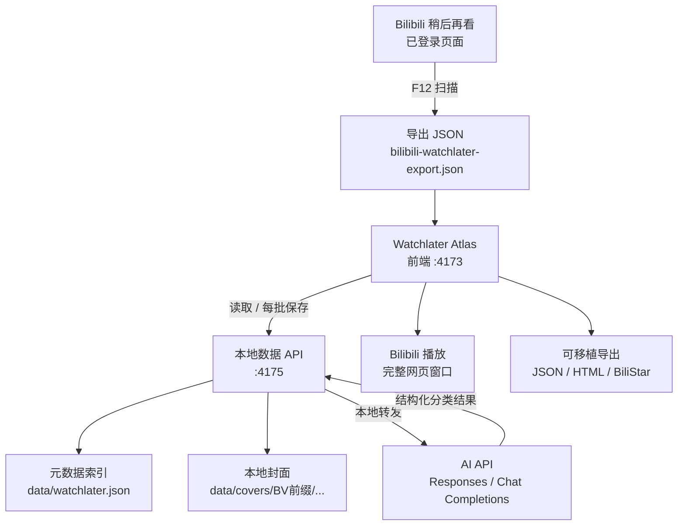
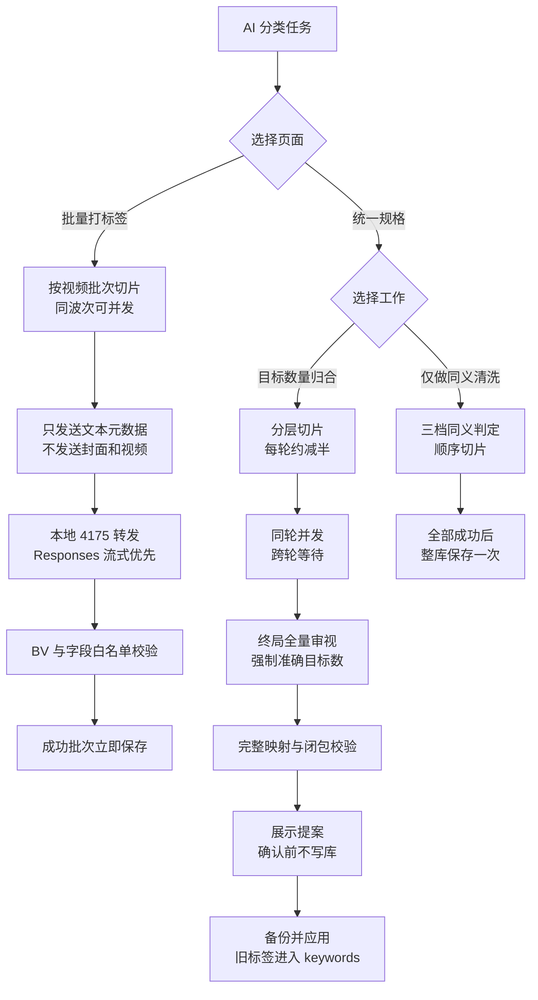

# Watchlater Atlas

这是一个面向重度 Bilibili 用户的本地稍后再看资料库。它把原站只有一个长列表的“稍后再看”，转换成可搜索、可编辑、可分类、可归档、可写备注、可由 AI 辅助整理，并且可以长期保存在本地文件中的视频数据集。

Watchlater Atlas 不下载视频文件本身。它保存视频在列表页能够取得的元数据、原站 CDN 封面地址和本地化封面，并提供完整 Bilibili 网页窗口用于正常登录播放。需要管理已经下载到本地的视频文件时，可以把资料导出到配套的 BiliStar Video 项目。

## 项目解决的问题

Bilibili 稍后再看适合临时保存少量视频，但当列表增长到几百或上千条后，会出现以下问题：

- 所有视频挤在一个列表里，缺少分类、标签、收藏夹和个人备注。
- 搜索和重复整理效率较低，难以形成长期维护的资料库。
- 列表容量和账号状态受原站约束，无法作为稳定的个人数据存档。
- 封面传递了大量视觉信息，但普通链接导出通常没有本地封面文件。
- 一次渲染近千张卡片和图片会造成明显的 DOM、图片解码和内存压力。
- 使用 AI 分类时，整库一次发送容易超过模型上下文，而且失败过程难以观察和恢复。

Watchlater Atlas 将这些职责拆分为采集、导入、封面本地化、人工整理、AI 分类、播放和导出几个可独立控制的阶段。

## 核心能力

| 能力 | 说明 |
| --- | --- |
| 登录态采集 | 采集代码直接运行在已经登录的 Bilibili 稍后再看页面中，不读取或导出 Cookie |
| 元数据契约 | 使用 `bili-library/v2` 保存 BV 号、标题、作者、播放量、观看进度、受控标签、详细关键词、分类、备注和 AI 记录 |
| 封面双来源 | 同时保留原站 `coverOriginal` 和本地 `coverFile`，可在页面中切换 |
| 本地持久化 | 主模式写入 `data/watchlater.json` 和 `data/covers`，不依赖浏览器缓存 |
| 浏览器缓存 | 可选择把独立副本写入 localStorage，支持一键清空和专用迁移包 |
| 大规模浏览 | 默认使用窗口级虚拟无限滚动，只挂载视口附近的卡片；也可切换顶部固定分页 |
| 人工整理 | 支持标签、主分类、主题、收藏夹、状态、个人备注、归档、删除和手动新增 |
| 受控标签 | 将 1509 个历史标签压缩为约 200 个主标签，原始细节完整保留为可搜索 `keywords` |
| AI 分类 | 批量打标签与统一规格分成两页；支持精确目标数、分层归合、终局全量审视、提案预览和应用前备份 |
| 完整网页播放 | 使用复用登录 Cookie 的真实 Bilibili 顶层窗口，不使用受限 iframe 播放器 |
| 可移植导出 | 支持 JSON、CDN HTML、内嵌封面 HTML，以及导出到 BiliStar Video |

## 整体架构



采集脚本只负责列表页能够直接取得的数据。封面二进制下载、哈希计算、目录索引和 JSON 持久化由本地 `4175` 服务负责。AI 请求也通过同一个本地服务转发到用户配置的第三方 API，避免浏览器 CORS 限制；API Key 只在单次请求期间经过内存，不写入本地数据库或服务日志。

## 典型工作流程

1. 运行 `scan-watchlater.cmd`，把最新版采集代码复制到剪贴板。
2. 在已登录的 Bilibili 稍后再看页面打开 F12 Console，粘贴并执行。
3. 等待脚本完成虚拟列表滚动并下载 `bilibili-watchlater-export.json`。
4. 在 `http://localhost:4173/` 选择“本地文件”模式并导入 JSON。
5. 观察封面本地化任务，必要时暂停、继续、停止或重新补全。
6. 使用搜索、标签、分类、收藏夹、归档和备注进行人工整理。
7. 在“批量打标签”页让 AI 从受控词表选择主标签并补充详细关键词。
8. 标签数量过多时，在“统一规格”页填写最终目标，生成可审计提案，确认后再备份并应用。
9. 继续在本地资料库中维护，或者导出通用 JSON、浏览器缓存包、HTML 和 BiliStar 数据集。

## 受控标签与标签纪念册

主界面的标签云不是无上限的关键词集合。项目把标签信息分成两层：

- `tags`：受控、稳定、适合人类浏览的主标签，当前目标约 200 个。
- `keywords`：人名、作品名、软件名、技术名、长尾描述和压缩前原始标签；参与搜索，但不显示在主标签云。

受控词表锁定后，AI 返回和人工编辑都不能直接创造第 201 个主标签。编辑框中输入的词表外名称会自动转存到 `keywords`；若一条新记录因此没有主标签，程序使用规范标签“综合”兜底。

当前真实资料库曾有 991 条视频、1509 个唯一标签，其中 82.3% 的标签只出现一到两次。项目先把完整历史导出成“标签纪念册”，再执行可回滚压缩。历史标签没有被永久删除：它们同时保留在本地纪念册、压缩前数据库备份和每条视频的 `keywords` 中。

```powershell
# 导出当前完整标签纪念册
npm run export:tag-memory

# 只生成压缩报告，不修改数据库
npm run compress:tags -- --target 200

# 创建完整备份后正式应用
npm run compress:tags -- --target 200 --apply
```

详细算法、字段契约、AI 分层收敛、确定性备用脚本、回滚方法和验收标准见 [受控标签统一规格](./docs/TAG-COMPRESSION-SPEC.md)。

## 启动

```powershell
npm install
npm run start
```

前端地址：`http://localhost:4173`

`npm run start` 同时启动：

- Vite 前端：`4173`
- 本地 JSON API：`4175`
- 数据文件：`data/watchlater.json`
- 封面目录：`data/covers/<BV号前4位>/<完整BV号>.<扩展名>`

启动服务后，可以运行隔离的统一规格回归测试：

```powershell
npm run test:taxonomy
```

测试使用独立浏览器缓存和模拟 AI 返回，验证 `120 -> 60 -> 20` 的分层请求、终局全量审视、提案阶段零写入、应用前快照、准确目标数、旧标签关键词保留、浏览器缓存包去除本机封面路径，以及清空缓存后保留 AI 配置；不会读取或修改真实 `data/watchlater.json`。

## 两种保存模式

- `本地文件`：写入工作目录中的 `data/watchlater.json`，适合长期使用和本地开发。
- `浏览器缓存`：写入当前站点的 `localStorage`，适合临时查看或把一套数据带到另一台浏览器。

两种模式是独立副本，不会自动同步。本地文件已经成为长期主资料库后，可以点击顶部“清理缓存”，只删除 `watchlater.items` 和 `watchlater.taxonomy`；`data/watchlater.json`、`data/covers` 和 AI 配置 `watchlater.ai.config` 不受影响。清理时如果正在查看浏览器缓存，页面会自动切回本地文件。

“导出数据”提供两种 JSON：通用 JSON 完整保留当前字段，适合备份和迁移；浏览器缓存包会去掉 `coverFile`、封面哈希等只在本机服务有意义的字段，保留 Bilibili CDN 封面地址，适合导入浏览器缓存模式。顶部导入、JSON、HTML 和 BiliStar 命令旁都有问号按钮，以不会撑长页面的居中悬浮窗说明用途和取舍。

本地文件模式导入后会启动后台封面本地化任务。页面会持续显示总数、完成数、成功数、失败数、剩余数、百分比和当前 BV 号，并提供“暂停”“继续”“停止”控制。任务使用 4 个并发下载工作线程、网络重试和分批持久化，暂停、停止或完成时会强制保存进度；处理期间会临时禁用导入、编辑、归档和删除，避免旧页面状态覆盖服务端的新封面索引。

也可以点击“补全封面”重新处理缺失记录。服务会优先使用 JSON 中的 `coverOriginal`，缺失时再从视频链接解析 BV 号并调用 Bilibili 的公开视频元数据接口补查封面。图片经过类型和大小验证后计算 SHA-256，并写入分层目录。JSON 索引会记录 `coverOriginal`、`coverFile`、`coverMime`、`coverBytes`、`coverSha256` 和 `coverFetchedAt`。

页面工具栏提供两种封面显示来源：

- `本地优先`：优先加载 `coverFile` 或内嵌 `coverData`，没有本地封面时再使用 `coverOriginal`。
- `原站 CDN`：只加载 Bilibili 原站封面地址，方便核对原始资源，也可以在本地服务不可用时联网查看。

## 单文件 HTML 快照

点击顶部的 `HTML` 可以把当前资料库导出成一个可直接双击打开的 HTML 文件。导出文件自带样式、搜索、状态筛选、标签筛选、封面来源切换和 Bilibili 视频打开入口，不依赖 React、Vite、`4173` 或 `4175` 服务。

导出时可以选择：

- `图片随 HTML`：读取本地封面并转换为 `data:image/...` 写入 HTML。Base64 编码通常会让图片数据增加约 33%，页面会按当前本地图片总量显示预估体积；如果某张图片无法读取，导出完成提示会显示失败数量。
- `仅保留原站 CDN 地址 · 推荐`：移除 `coverData`、`coverFile` 和 localhost 地址，只保存 `coverOriginal`。文件明显更小，但查看封面时需要联网。

内嵌模式仍保留原站 CDN 地址，所以导出的 HTML 可以在“图片随文件”和“原站 CDN”之间切换。近千张封面不适合长期塞进一个 HTML：推荐保留本项目的 `data/watchlater.json` 和 `data/covers` 作为主资料库，有网络时导出 CDN 版 HTML；只有确实需要完整离线快照时才选择内嵌图片。HTML 是导出时的只读快照；继续编辑、归档和删除数据时，应回到本地应用操作后重新导出。

播放器提供“B站网页窗口”和“新标签”两个入口。“B站网页窗口”不是 iframe 或独立 WebView，而是通过 `window.open` 打开的真实顶层浏览器窗口，直接加载完整的 `www.bilibili.com/video/<BVID>/` 视频页面。它与当前浏览器会话使用同一站点 Cookie，因此登录账号、会员画质、声音、全屏、播放历史和账号权限均由正常 Bilibili 页面处理。所有视频复用同一个 `watchlater_atlas_player` 命名窗口，因此不会不断制造新标签；资料库底部的窗口控制条可重新聚焦或关闭它。“新标签”则在普通新标签中打开同一个完整视频页面。

浏览器的跨域安全模型不允许把完整 Bilibili 页面直接绘制在 `4173` 页面的 DOM 中，同时又绕开 iframe 的第三方上下文限制。因此，“B站网页窗口”采用由资料库页面控制的顶层悬浮窗口：视觉上是可移动、可缩放、可关闭的独立网页窗口，但仍属于当前浏览器配置文件和登录会话。

## 从 Bilibili 采集

Windows 用户可以直接双击项目根目录中的：

```text
scan-watchlater.cmd
```

启动器和所有操作提示均为中文。CMD 会切换到 UTF-8，并显式按 UTF-8 加载 PowerShell 脚本，因此不依赖 Windows 系统区域设置，也不会因为中文项目路径或中文提示产生乱码。

它会把采集代码复制到剪贴板并打开 Bilibili 稍后再看页面。随后只需在已登录的 Bilibili 标签页打开开发者工具 `Console`，粘贴并按回车。完整流程和故障排查见 [SCAN-WATCHLATER-WINDOWS.md](./SCAN-WATCHLATER-WINDOWS.md)。

如果已经在 Codex 内置浏览器中登录 Bilibili，可以运行 `.\scan-watchlater.cmd -NoOpen`，只复制脚本，然后回到现有的 Bilibili 标签页执行。

最稳妥的方式是在已经登录的 Bilibili 稍后再看列表页，打开开发者工具控制台，粘贴并执行：

`tools/bilibili-watchlater-console.js`

它会滚动虚拟列表、去重、读取标题、视频 URL、BV 号、原站封面 URL、作者、作者 ID、加入时间、播放量、观看进度和卡片文本，并下载 `bilibili-watchlater-export.json`。采集脚本不再跨域下载近千张图片二进制；导入本地站点后，由 `4175` 后台任务负责可靠地下载、校验、索引和分层保存封面。

也可以运行独立脚本：

```powershell
npm run export:bilibili
```

这个命令会新开一个可见浏览器窗口，需要在该窗口内登录 Bilibili 后采集。导出路径默认为 `data/bilibili-watchlater-export.json`，也可以传入目标路径：

```powershell
node tools/bilibili-watchlater-export.mjs .\data\my-export.json
```

当前 Bilibili 列表使用虚拟渲染，DOM 中不会同时存在全部 994 条记录。两个采集脚本都采用“滚动 + 去重 + 连续多轮无新增后停止”，以覆盖能从列表页直接获得的记录；它们不会逐个打开视频。

新版采集器只读取包含 `` 的视频封面链接，并在同一 BV 号重复出现时保留非空的 `cover` 和 `coverOriginal`。这是必要的，因为 Bilibili 会为同一个视频生成多个 `/list/watchlater/` 链接：旧脚本可能先读到带图片的链接，随后又被不带图片的标题链接覆盖，导致导出的封面字段变成空字符串。新版还会移除 `@672w_378h_1c.webp` 一类缩放后缀，保存可长期补全的原始 CDN 地址。

### 实际采集结果

下面是控制台脚本在已登录的 Bilibili 稍后再看页面中的实际运行过程。脚本会持续向下滚动，并按照 BV 号去重；控制台中的“已采集”数字会随着新卡片进入虚拟列表而增长。


下面三张截图记录的是旧版脚本的一次 994 条采集，用于说明 F12 操作位置和下载结果。旧版脚本存在重复链接覆盖问题，可能把已经采集到的封面 URL 覆盖为空；“成功内嵌封面 0 条”也说明浏览器没有允许控制台脚本跨域读取图片二进制。当前 `tools/bilibili-watchlater-console.js` 已修复 URL 丢失问题，并明确把图片二进制本地化交给 `4175` 后台任务。


采集结束后，浏览器会自动下载 `bilibili-watchlater-export.json`。本次包含 994 条记录的导出文件约为 478 KB；下载完成后，回到 `http://localhost:4173/`，选择“本地文件”模式并点击“导入”即可开始元数据保存和封面本地化。


## 大数据量性能

默认使用窗口级虚拟无限滚动。搜索、状态筛选和标签筛选仍然作用于完整资料库，但页面只挂载当前视口附近的行；滚到列表中部或底部时，已经离开视口的卡片会被卸载。封面图片同时启用了延迟加载和异步解码。

工具栏可以切换为“分页”模式。分页器位于列表顶部，每页 48 条，适合需要明确页码定位的场景；切回“无限滚动”后恢复虚拟列表。显示方式会保存在当前浏览器的 `watchlater.listMode` 设置中。

`本地文件`模式不会再把整套数据同步复制到 localStorage。`浏览器缓存`模式仍使用 localStorage，但写入会在数据稳定后防抖，并尽量安排到浏览器空闲时间执行。导入和封面下载是两个阶段：JSON 会先写入本地索引，随后封面任务在后台推进，进度可在页面中直接观察和控制。

封面任务状态也可以通过以下接口读取或控制：

```text
GET  http://localhost:4175/api/cover-job
POST http://localhost:4175/api/cover-job/start
POST http://localhost:4175/api/cover-job/pause
POST http://localhost:4175/api/cover-job/resume
POST http://localhost:4175/api/cover-job/cancel
```

## AI 标签与分类

顶部的“AI 标签”支持 OpenAI Responses API 和兼容的 Chat Completions API。默认配置为：

```text
协议：Responses API
地址：https://api.openai.com/v1/responses
模型：gpt-5.6-luna
增量批次：20 条/请求
并发请求：1
统一规格：默认目标 200，每片 500，同轮并发 2
同义清洗：超过 1000 词时按 500 词顺序切片
同义判定：严格同义 / 无损近义 / 安全上下位归并
```

Responses 模式使用 `instructions`、`input`、`stream: true` 和 `text.format`；优先请求严格 JSON Schema，兼容服务不支持时会降级为 `json_object`。浏览器增量解析 SSE 的 `response.output_text.delta`，并在 `response.completed` 中读取完整响应和 `usage`。本地转发每 15 秒发送一条 SSE 注释心跳，防止本机链路和中间代理因长时间无字节而空闲超时。心跳不属于模型事件，也不表示模型已经产生正文。Chat Completions 仍可在协议选择器中启用，并保留非流式兼容路径。

API 地址、协议、模型、API Key、批量大小、批量并发数、统一规格目标、统一规格切片与并发、归并尺度、同义清洗配置和自定义分类规则保存在当前站点的 localStorage：

```text
watchlater.ai.config
```

API Key 不会写入 `data/watchlater.json`、导出 JSON 或本地服务端文件。共享电脑不建议保存长期密钥。浏览器把每批请求交给 `http://localhost:4175/api/ai-proxy`，本地服务再使用同一台电脑的网络连接第三方 API；因此第三方服务不需要允许 `http://localhost:4173` 的浏览器 Origin。转发接口只接受 HTTPS 地址，并拒绝本机、`.local` 和常见私有网段目标。

“每批视频数”表示一条 API 请求里携带的视频数量。默认 20 表示一次发送 20 个相互独立的视频对象，并在同一次响应中取回最多 20 组标签，不是连续发送 20 次请求，也不是相关推荐数量。增量批次允许设置 5-40 条；并发请求数接受任意正整数，实际并发不会超过剩余批次数。高并发由用户自行控制，可能触发第三方服务的 429、RPM、TPM、连接数限制和瞬时高额 Token 消耗。

每批只发送 BV 号、标题、作者、描述、现有标签、现有关键词、主分类和备注，不发送封面图片或本地文件。模型必须返回包含 `id`、`tags`、`keywords`、`category`、`topics`、`collections` 和 `reason` 的 JSON；应用只接受当前批次中存在的 BV 号。资料库存在根级 `taxonomy` 时，`tags` 还必须通过受控词表白名单，模型新产生的人名、作品名、软件名、技术名和长尾描述只能进入 `keywords`。提示词明确要求每个视频独立判断，不得借用同批其他视频的内容推断或复制标签。

任务面板显示候选数、已完成数、成功/失败数、当前批次、当前 BV 号、耗时、SSE 事件数、已接收字节、最近活动时间和最近一次保存/错误信息，并支持暂停、继续和停止。完成事件到达后还会累计输入、缓存输入、输出、推理和总 Token。每个成功增量批次会立即保存到当前模式对应的位置，所以中途暂停、网络失败或停止不会丢失此前已经成功的批次。

### AI 工作流程



### 如何保证写入结果符合规范

模型本身不能被绝对保证每一次都遵守指令。本项目采取的策略不是“相信模型一定正确”，而是“只有通过本地校验的结果才允许写入”。因此可以保证的是：不符合项目契约的返回不会污染本地资料库。

| 校验层 | 约束 | 不符合时的行为 |
| --- | --- | --- |
| 请求级 Schema | Responses 使用 `text.format.type = json_schema`、`strict: true`、完整 `required` 和 `additionalProperties: false` | 兼容服务不支持严格 Schema 时，降级为 JSON Object，但仍需经过后续本地校验 |
| 输出文本提取 | 只读取 Responses 的 `output_text`，或 Chat Completions 的 `choices[0].message.content` | 找不到文本时整批失败 |
| JSON 语法 | 去除可能存在的 Markdown 代码围栏后执行 `JSON.parse` | 不是合法 JSON 时整批失败，不保存 |
| 统一规格准确数量 | `canonicalTags` 去重后必须恰好等于本请求目标，终局必须恰好等于用户最终目标 | 当前片自动重试一次；仍不合格则整项失败，不生成提案 |
| 统一规格完整映射 | 每个来源词必须出现且只出现一次，`to` 必须属于本次 `canonicalTags`，每个规范词至少被使用一次 | 缺项、重复、非法目标或空规范词都会拒绝 |
| 终局全量审视 | 即使中间分片提前达到目标数，也必须再用一次请求查看全部候选词 | 终局没有通过时不能进入提案状态 |
| 批次 ID 白名单 | 返回的 `id` 必须存在于当前发送批次 | 模型额外生成或篡改的 BV 号被丢弃 |
| 字段类型 | `tags`、`topics`、`collections` 必须能规范化为字符串数组 | 非法值转换为空数组或导致该结果无法匹配 |
| 数量限制 | 标签最多 8 个、关键词最多 12 个、主题最多 5 个、建议收藏夹最多 5 个 | 超出部分被截断，避免单条结果失控 |
| 受控词表 | 根级 `taxonomy` 存在时，返回标签必须属于 `canonicalTags` | 模型创造的新主标签被丢弃；细节应写入 `keywords` |
| 字符串清洗 | 去除首尾空白、空字符串和重复值 | 清洗后的结果再进入保存阶段 |
| 有效结果检查 | 当前批次至少要有一条可匹配结果 | 完全无法匹配时整批失败 |
| 人工数据保护 | 批量打标签合并标签和关键词；同义清洗只重命名已有主标签，模型未返回映射的名称原样保留 | 不会因为清洗结果缺项而删除标签或关键词 |
| 逐批持久化 | 每批验证成功后立即保存，不等待整个任务完成 | 暂停、停止或后续失败不影响已完成批次 |
| 提案与应用隔离 | 统一规格生成轮次、规范词和全量来源映射后只进入预览状态 | 点击“备份并应用”前不修改视频或 taxonomy |
| 应用前终检 | 每个视频 1-5 个主标签，全部主标签属于规范词表，每个规范词有实际视频引用 | 任一条件不满足时保持原数据库不变 |

严格 Schema 的核心返回结构如下：

```json
{
  "items": [
    {
      "id": "BV1xxxxxxxxx",
      "tags": ["人工智能", "编程"],
      "keywords": ["Claude Code", "MCP"],
      "category": "科技",
      "topics": ["大模型", "开发工具"],
      "collections": ["待深入研究"],
      "reason": "标题和描述主要讨论 AI 开发工具"
    }
  ]
}
```

Schema 要求每个对象都必须包含以上七个字段，并禁止额外字段。即便兼容 API 只能使用 `json_object`，返回结果也必须通过相同的 BV 号白名单、受控标签白名单、字段清洗、数组限制和有效结果检查。

### 切片与上下文控制

AI 任务不会把完整的近千条数据一次发送。任务启动时会创建一个待处理队列，然后按照配置的 `batchSize` 切片：

- 默认 20 条，允许设置 5-40 条。
- 资料库已锁定 `taxonomy` 时，发送完整受控标签词表；未锁定时，已有标签按使用次数排序，最多发送 160 个。
- 每条记录只发送 `id`、`title`、`author`、`description`、`currentTags`、`currentKeywords`、`currentCategory` 和 `note`。
- 不发送封面 URL 的图片内容、Base64、本地文件、封面哈希或播放窗口状态。
- 每批独立请求、独立校验、独立保存，失败后可以重新处理仍未生成 `ai.processedAt` 的记录。
- 每个视频在提示词中被声明为独立对象，模型不得用同批其他视频的内容推断当前视频。

这种设计把上下文占用限制在可预测范围，也让失败重试只影响当前批次，而不是重新处理整个资料库。

### 锁定词表如何消除跨批次漂移

旧的运行时复用方案只能让后续波次参考已经完成的标签，同一并发波次仍无法交换结果。资料库完成目标压缩后，根级 `taxonomy.canonicalTags` 成为锁定词表；所有批次从任务开始就看到同一套主标签，本地还会拒绝不在词表中的返回值。因此并发只影响吞吐，不再决定主标签命名是否一致。

```text
任务开始：读取根级 taxonomy.canonicalTags
    ↓
所有请求：携带同一套锁定主标签
    ↓
模型：主标签只能选择，细节写入 keywords
    ↓
本地：再次执行主标签白名单校验
    ↓
逐批保存 tags、keywords 和 AI 记录
```

并发数影响这个反馈速度：

| 并发 | 标签复用行为 | 适用场景 |
| ---: | --- | --- |
| 1 | 所有批次使用同一锁定词表 | 服务限流严格、希望控制瞬时 Token |
| 2 或更高 | 所有并发批次仍使用同一锁定词表 | API 稳定、希望提高处理速度 |

并发不是把一个批次拆开，而是同时执行多个完整批次。例如“每批 20、并发 3”表示同时发出 3 条请求，每条请求各含 20 个视频，当前波次最多处理 60 条。程序不再限制为 1-4，但输入 1000 并不意味着一定建立 1000 条连接：调度器最多只会启动当前剩余的完整批次数。并发越高越容易触发第三方 API 的每分钟请求数、Token、并发连接和账户预算限制。

### 统一规格与同义清洗

“统一规格”页包含两种相互独立的工作：

- `目标数量归合`：把当前完整主标签词表逐层归并到用户填写的准确目标数，例如 `1509 -> 200`。
- `仅做同义清洗`：只统一缩写、语言、格式、字符损坏和允许范围内的近义名称，不承诺最终数量。

目标数量归合采用“近似二分 + 终局全量审视”。默认每片 500 个词；每轮把高于目标的候选总量大约减半，同一轮可并发，下一轮必须等待上一轮全部通过。候选进入单请求安全范围后，模型会看到全部候选并被要求返回准确数量。即使前一轮因为跨片名称重合而提前正好达到目标，也仍会再执行一次终局全量请求。

以 `1509 -> 200` 为例，典型计划是：

```text
第 1 轮：1509 -> 755，4 个切片请求
第 2 轮：755 -> 378，2 个切片请求
第 3 轮：378 -> 200，1 个终局全量请求
```

每个请求都必须返回准确的本片 `canonicalTags`，并让每个来源词恰好映射一次。每个目标必须属于规范词表，每个规范词必须至少被使用一次。单片结构校验失败会自动重试一次；仍失败则整项任务停止。所有轮次通过后只生成提案，界面展示轮次、来源映射数量和规范词预览，点击“备份并应用”前不会修改任何视频或 taxonomy。

应用时，本地文件模式先在 `data/backups` 创建完整数据库备份；浏览器缓存模式先下载应用前 JSON 快照。程序把旧主标签全部并入对应视频的 `keywords`，再验证每个视频有 1-5 个合法主标签、最终实际使用标签数准确等于目标数，然后整库写入一次。

目标归合的三档尺度：

| 尺度 | 判定方式 |
| --- | --- |
| 保守分层 | 尽量保留具体类别，只在达到数量目标所必需时向上归并 |
| 均衡归类 | 保留稳定中层概念，优先合并同义、近义和过细子类，默认推荐 |
| 强力收敛 | 更偏向宽泛导航入口，具体信息更多依靠 `keywords` 搜索 |

同义清洗的三档判定：

| 判定 | 允许关系 |
| --- | --- |
| 严格同义 | 缩写、全称、中英文、大小写、空格、字符损坏和明确同义 |
| 同义与无损近义 | 替换后基本不改变检索意图的近义名称 |
| 含安全上下位归并 | 还允许明显过细且可安全归入上位概念的名称，需要更多人工检查 |

三档解释都通过字段旁的问号打开居中悬浮说明，不会在表单中内联展开。完整算法、输出契约、备份和验收标准见 [受控标签统一规格](./docs/TAG-COMPRESSION-SPEC.md)。

### 统一规格的轮次与请求数量级

统一规格的单个请求只发送标签名称和使用次数，不发送近千条视频。默认每片 500 个词、目标 200，非终局轮次每次约减半，最后一轮才全量审视全部候选。下面是计划数量；实际跨片同名可能让中间候选更少，但程序不会允许低于目标，并始终保留终局请求。

| 当前唯一标签 | 典型轮次 | 默认总请求数 | 说明 |
| ---: | --- | ---: | --- |
| 200 | `200 -> 200` | 1 | 即使数量不变也执行一次全量命名审视 |
| 500 | `500 -> 200` | 1 | 单请求安全范围内直接终局处理 |
| 1000 | `1000 -> 500 -> 200` | 3 | 首轮 2 片，终局 1 次 |
| 1509 | `1509 -> 755 -> 378 -> 200` | 7 | 请求数约为 `4 + 2 + 1` |
| 2000 | `2000 -> 1000 -> 500 -> 200` | 7 | 请求数约为 `4 + 2 + 1` |
| 5000 | `5000 -> 2500 -> 1250 -> 625 -> 313 -> 200` | 21 | 请求数约为 `10 + 5 + 3 + 2 + 1` |

切片越小，单请求上下文更安全，但完整来源映射、提示词和 Schema 会重复更多次；切片越大，请求更少，但输入和输出都更接近模型上下文上限。统一规格的输出通常比同义清洗大得多，因为它不能只返回改变项，而是必须返回本片每个来源词的完整映射。建议先使用 500；上下文较小的模型可降到 200-300，上下文和输出上限充足时可升到 700-1000。

### 同义清洗请求体与上下文数量级

下表使用真实 1690 词词表的平均条目大小，以及当前提示词和严格 JSON Schema 计算 UTF-8 请求体。5000 词一行用同等长度的合成标签补足，因此它是容量规划数据，不是计费结果。Token 粗估采用每 Token 约 2-4 个 UTF-8 字节的宽范围；中文、英文缩写、JSON 标点、模型分词器和兼容网关都会改变实际值。

| 唯一标签数 | 不切片完整请求体 | 粗估输入 Token | 默认请求数 | 上下文风险判断 |
| ---: | ---: | ---: | ---: | --- |
| 100 | 5.4 KB | 1.4K-2.8K | 1 | 16K 及以上通常充足 |
| 500 | 20.2 KB | 5.2K-10.3K | 1 | 16K 需预留输出，32K 更稳妥 |
| 1000 | 39.1 KB | 10.0K-20.0K | 1 | 16K 高风险，32K 仍需控制输出 |
| 1500 | 58.1 KB | 14.9K-29.7K | 3 | 不切片时 32K 接近上限，默认切片 |
| 2000 | 78.0 KB | 20.0K-39.9K | 4 | 不切片时 32K 很可能不足，默认切片 |
| 5000 | 206.9 KB | 53.0K-106.0K | 10 | 不切片时 64K 高风险，128K 也需预留输出 |

默认阈值是“超过 1000 才切片”，所以恰好 1000 词仍为一个请求。可以把阈值调低，强制更早切片；也可以修改每片词汇数。后续分片除了最多 500 个来源词，还会携带最多 240 个高频规范锚点。按当前真实词长测算，“500 来源词 + 240 锚点”的请求体约 29.0 KB，粗估约 7.4K-14.8K 输入 Token，通常比 1690 词单请求更适合 32K 上下文。

上下文窗口并不只装输入。模型还需要容纳可见 JSON 输出和可能存在的内部推理 Token，所以不能因为粗估输入刚好低于 16K、32K 或 64K 就认为一定安全。准确数字应以完成事件中的以下字段为准：

```text
usage.input_tokens
usage.input_tokens_details.cached_tokens
usage.output_tokens
usage.output_tokens_details.reasoning_tokens
usage.total_tokens
```

切片会重复发送提示词和 Schema，因此整项任务的累计输入可能高于一个超大请求；它换来的是更低的单请求上下文压力、可观察的分片进度、更容易停止，以及更小的超时重试损失。归核分片保持顺序执行，不能使用增量分类的并发设置。

### Responses 流式请求

Responses 请求设置 `stream: true`。本地 `4175` 服务不再调用 `arrayBuffer()` 等待整个上游响应，而是立即转发 `text/event-stream`，浏览器逐块解析事件：

```text
response.created / response.in_progress
    ↓
response.output_text.delta（持续拼接 JSON 正文）
    ↓
response.completed（读取最终响应与 usage）
    ↓
本地 JSON.parse、白名单校验、字段清洗
    ↓
验证通过后保存
```

流式传输解决的是“有数据就立即可见”和长连接缓冲问题，不保证模型在长时间推理期间一定发送正文。为降低中间层空闲超时风险，本地转发器每 15 秒发送 `: relay-heartbeat` SSE 注释；浏览器会把它计入接收字节和最近活动时间，但不会把它当作模型事件或 JSON 内容。若第三方服务本身设置了硬执行时限，心跳无法延长该服务的模型计算时限。

解析器只拼接 `response.output_text.delta`。`response.completed` 中的完整正文只在此前没有收到任何 delta 时作为兼容回退，不会把“增量正文 + 完成正文”再拼一次，因此不会因为标准 Responses 完成事件导致同一份 JSON 重复两遍。

### 单条视频实际发送什么

AI 不会逐条单独请求。默认每 20 条视频组成一个批次，每条视频只贡献下面这个文本对象：

```json
{
  "id": "BV1xxxxxxxxx",
  "title": "视频标题",
  "author": "作者名称",
  "description": "视频简介",
  "currentTags": ["已有标签"],
  "currentCategory": "已有主分类",
  "note": "人工备注"
}
```

| 字段 | 类型 | 作用 |
| --- | --- | --- |
| `id` | 字符串 | 结果关联和批次 BV 号白名单，不允许模型修改 |
| `title` | 字符串 | 分类时最主要的文本依据 |
| `author` | 字符串 | 辅助识别作者和内容领域 |
| `description` | 字符串 | 提供主题、技术方向和内容摘要 |
| `currentTags` | 字符串数组 | 让 AI 复用已有人工标签体系 |
| `currentCategory` | 字符串 | 让 AI 参考已有主分类 |
| `note` | 字符串 | 把人工整理意图纳入分类判断 |

不会发送封面图片、封面 Base64、封面 CDN 地址、本地封面文件、视频文件、视频画面、Bilibili Cookie、本地视频路径或完整资料库。当前 AI 分类只读取文本元数据，不具备观看视频或分析封面的能力；标题和简介都很少时，分类质量会主要依赖作者、已有标签和备注。

### 实测请求数据量

下面的数据来自一套 991 条记录的实际资料库快照，只统计 UTF-8 JSON 请求体，不包括 HTTP 请求头、API Key 长度和 Responses 原始响应信封。数据集变化后数值也会变化。

| 单条输入指标 | 大小 |
| --- | ---: |
| 平均 | 542 B |
| 中位数 | 338 B |
| 90% 不超过 | 1,136 B |
| 99% 不超过 | 2,709 B |
| 最大 | 4,971 B |

单条大小差异主要来自 `description`。该快照中简介平均约 167.5 个字符，最长约 2,000 个字符。每批还会重复附带分类规则、严格 JSON Schema 和最多 160 个已有标签；该快照包含 143 个已有标签，标签词表约 1,913 B。

| 每批数量 | 批次数 | 平均请求体 | 90% 请求体 | 最大请求体 | 全部输入累计 |
| ---: | ---: | ---: | ---: | ---: | ---: |
| 5 | 199 | 6.36 KB | 8.10 KB | 10.18 KB | 1.27 MB |
| 20，默认 | 50 | 14.88 KB | 17.86 KB | 21.51 KB | 744 KB |
| 40 | 25 | 26.26 KB | 31.15 KB | 34.17 KB | 657 KB |

批次越小，规则、Schema 和标签词表被重复发送的次数越多，因此整库累计输入反而更大。字节数不等同于模型 Token；准确 Token 和费用应以第三方 API 响应的 `usage` 为准。当前任务面板会累计显示输入、缓存输入、输出、推理和总 Token；兼容网关没有返回某个 usage 字段时，对应数值保持为 0。

### 模型返回和本地合并

每条有效结果包含 `id`、`tags`、`keywords`、`category`、`topics`、`collections` 和 `reason`。本地校验通过后：

- 增量分类会把 AI 主标签和详细关键词分别与现有数据合并并去重；锁定词表时，陌生主标签不会写入。
- 同义清洗不会重新判断视频内容，而是把已有主标签按全局映射统一命名；关键词、主分类、主题和收藏夹保持不变。
- 统一规格也不发送视频详情；它把全部来源标签映射到准确数量的规范词，并把应用前主标签并入 `keywords`。
- 主分类仅在 AI 返回非空值时更新。
- 主题和建议收藏夹写回对应数组。
- `ai.status`、`ai.model`、`ai.processedAt`、`ai.reason`、`ai.mode` 和 `ai.tagStrategy` 跟随批量结果保存；同义清洗写入 `ai.consolidatedAt`、`ai.consolidationModel` 和 `ai.consolidationSummary`；统一规格写入 `ai.taxonomyUnifiedAt`、`ai.taxonomyModel`、`ai.taxonomyStrategy` 和 `ai.taxonomySummary`。
- 每批至少要有一条结果匹配当前 BV 号白名单，否则整批失败且不写入。

实测已保存的结构化 AI 结果平均约 302 B/条。原始 API 响应通常还包含 Responses 信封、状态和 Token 使用量，因此实际下行流量会略大。

### 本地保存开销

“逐批保存”保证中途暂停或后续失败不会丢失已经完成的分类，但当前实现会在每个成功批次后保存完整资料库，而不是只写入本批差异。在上述 991 条快照中：

```text
发送给本机 4175 的紧凑 JSON：约 1.37 MB/成功批次
格式化后的 data/watchlater.json：约 1.59 MB
默认 20 条一批、约 50 批：本机累计传输约 68.5 MB
默认 20 条一批、约 50 批：磁盘累计重写约 79 MB
```

这些完整资料库数据只在本机浏览器、`4175` 服务和本地磁盘之间移动，不会上传给 AI。文件写入使用临时文件加重命名，避免直接覆盖过程中留下半个 JSON。对于数千到数万条记录的资料库，后续更值得优化的是增量写入或本地数据库，而不是继续缩小 AI 批次。

### 常见问题和容易踩的坑

| 现象或风险 | 原因 | 处理方式 |
| --- | --- | --- |
| 浏览器显示 `Failed to fetch` | `4175` 没有启动、页面仍缓存旧代码，或本机服务不可达 | 使用 `npm start` 启动完整项目，确认 `http://localhost:4175/api/watchlater` 可访问，再刷新 `4173` 页面 |
| 第三方 API 拒绝 `Origin: http://localhost:4173` | 旧版由浏览器直接跨域请求，预检被第三方 CORS 拒绝 | 当前版本通过 `4175/api/ai-proxy` 转发；不要把请求改回浏览器直连 |
| API 返回 401 或 403 | API Key 无效、过期、权限不足或网关要求不同鉴权 | 检查 Key、账户余额和服务商文档；Key 只保存在当前站点 localStorage |
| API 返回 404 | 协议和地址不匹配 | Responses 通常使用 `/v1/responses`，Chat Completions 通常使用 `/v1/chat/completions` |
| API 返回模型不存在 | 兼容服务没有提供 `gpt-5.6-luna` 或使用了其他模型别名 | 把模型字段改为该服务实际支持的名称 |
| 同一批可能请求两次 | 严格 JSON Schema 收到 400/422 后会降级为 `json_object` 重试 | 使用支持 Responses strict Schema 的服务；计费时注意首次失败请求可能仍产生用量 |
| 返回了 JSON 但整批失败 | BV 号被修改、没有匹配当前批次、输出藏在不支持的字段或不是合法 JSON | 查看任务面板错误；确认服务兼容 Responses `output_text` 或 Chat `message.content` |
| 标签质量不稳定 | 模型只看到文本元数据，不看封面和视频；标题或简介信息不足 | 补充人工备注、已有标签和主分类，或缩小批次后重试 |
| 任务停止后已有结果仍存在 | 每个成功批次都会立即持久化 | 这是预期行为；“尚未由 AI 处理”只选择没有 `ai.processedAt` 的记录 |
| 暂停按钮没有立刻停下 | 暂停会等待当前并发波次全部结束；停止才会中止当前请求 | 需要立即终止时使用“停止” |
| 小批次总 Token 反而更多 | 标签词表、规则和 Schema 在每批重复发送 | 默认 20 通常更均衡；API 稳定且上下文充足时可提高到 40 |
| 并发提高后标签不够统一 | 资料库尚未锁定 taxonomy，同一波次不能看到其他请求刚生成的标签 | 先运行目标压缩锁定受控词表；锁定后所有并发请求使用同一词表 |
| 并发请求频繁出现 429 | 第三方 API 有并发、RPM 或 TPM 限制 | 降低并发数或批次大小，等待服务商限流窗口恢复 |
| 并发数填写很大后瞬时用量异常 | 程序不限制并发上限，多个完整批次会同时占用连接和 Token 配额 | 先按 2、4、8 逐级测试服务商承受能力；不要把“允许任意正整数”理解成推荐无限并发 |
| “已有标签词表”看起来没有变化 | 同一波次的请求在开始时已经生成提示词 | 等到下一波请求检查；并发 1 时下一批即可看到新标签 |
| 同义清洗后标签数量仍很多 | 大多数词并非同义词，或模型安全地保留了未映射名称 | 这是预期行为；切换到“统一规格”，填写 200-300 的最终目标并生成提案 |
| 统一规格一直无法生成提案 | 模型没有返回准确目标数、漏掉来源映射、输出被截断或上下文不足 | 降低每片词汇数，检查模型最大输出和上下文；程序会重试一次，仍不合格时不会写库 |
| 统一规格已经达到目标却又发一次请求 | 中间分片只在各自局部统一，仍需一次包含全部候选的终局审视 | 这是设计要求，用于消除跨片命名漂移并确认准确最终词表 |
| 提案生成后标签还没有变化 | 统一规格把生成与应用分开，预览阶段不写数据库 | 检查轮次和规范词预览，确认后点击“备份并应用” |
| 同义清洗请求超过上下文 | 单片来源词、锚点和输出预算仍超过服务限制 | 降低每片词汇数或切片阈值；16K 上下文不建议使用 500+240 的默认组合 |
| 同义清洗错误合并 | 模型错误判断了语义关系，安全上下位归并模式风险更高 | 清洗前导出 JSON 备份，或改用严格同义；本地只保证映射来源合法，不能保证语义判断绝对正确 |
| 流事件持续增加但 Token 仍为 0 | usage 通常只在 `response.completed` 中返回，心跳也不携带 usage | 等当前请求完成；若完成后仍为 0，兼容网关可能没有返回标准 usage 字段 |
| 有心跳但长时间没有正文 delta | 模型仍在推理，或服务商只在末尾给出结构化正文 | 查看耗时和最近活动；心跳只能维持链路，不能缩短推理或突破服务商硬超时 |
| 本地文件频繁写入 | 每个成功批次重写完整资料库 | 千条规模通常可接受；超大资料库应考虑增量存储 |
| 本地模型地址被拒绝 | 转发接口出于 SSRF 防护，只允许 HTTPS 且拒绝 localhost 和私网目标 | 如需接入 Ollama 或局域网模型，应显式增加受控白名单，不要直接取消目标校验 |
| 导出的单文件 HTML 无法执行 AI 标签 | 单文件导出定位为浏览和检索，不包含正在运行的 `4175` 数据服务 | AI 整理应在本地项目模式完成，再重新导出结果 HTML |
| 共享电脑上的 Key 有泄露风险 | API Key 保存在站点 localStorage，任何获得该浏览器用户会话的人都可能使用 | 使用短期或限额 Key，完成后清除站点数据中的 `watchlater.ai.config` |

### 状态、暂停与停止

AI 任务状态包括：尚未开始、处理中、正在暂停、已暂停、正在停止、已停止、等待确认、正在应用、已完成和失败。

- 增量分类的“暂停”不会破坏正在进行的请求；当前并发波次全部结束后进入暂停状态。
- “继续”从队列游标位置继续，不重复已经完成的批次。
- “停止”会通过多个 `AbortController` 中止所有正在进行的并发请求，并保留此前已保存结果。
- 同义清洗按分片顺序执行，不提供暂停，只能等待完成或直接停止；停止时不会应用本次任务的任何映射。
- 统一规格的同轮切片可以并发，跨轮严格等待；停止或任一分片失败时不会产生可应用提案。
- 统一规格进入“等待确认”后计时停止；放弃提案不会修改资料库，应用时先备份再整库写入一次。
- API HTTP 错误、本地转发网络错误、JSON 解析错误和字段不匹配都会显示在任务面板中。
- 面板会展示当前 BV 号列表、批次编号、完成数、成功数、失败数、百分比、耗时、流事件、接收字节、最近活动、Token 用量和实际保存位置。

### AI 结果保存在哪里

在“本地文件”模式下，每个成功批次都会立即通过 `4175` API 写入：

```text
data/watchlater.json
```

在“浏览器缓存”模式下，每个成功批次会立即写入：

```text
localStorage: watchlater.items
```

同义清洗可能包含多个顺序映射请求，但只有全部分片验证通过后才整库保存一次。统一规格生成提案时完全不写库；本地文件确认应用后先创建 `data/backups/watchlater-before-ai-taxonomy-unification-<时间>.json`，浏览器缓存确认应用前先下载 JSON 快照，然后整库保存一次。

API Key 和 API 配置始终只保存在 `watchlater.ai.config`，不会进入视频数据文件。AI 生成的主标签、详细关键词、主分类、主题、建议收藏夹、模型名称、处理时间和分类依据会跟随视频记录进入 JSON、HTML 和 BiliStar 导出；同义清洗和统一规格的时间、模型、轮次及摘要也会跟随保存。流事件数、接收字节和 Token 用量属于当前任务运行状态，不写入视频数据。

## BiliStar Video

顶部“导出到 BiliStar”会生成同为 `bili-library/v2`、但 `libraryType` 为 `favorites` 的 JSON，可直接导入：

```text
D:\_CodeNotSync\_BiliStarVideo
```

BiliStar Video 使用 `4273/4275` 端口，增加主分类、多收藏夹、评分、原站失效状态、备注和本地视频文件绑定。绑定功能只保存现有视频文件的绝对路径，不复制或下载视频；本地服务通过 HTTP Range 流式播放已绑定文件。

## 数据契约

```json
{
  "version": 2,
  "schema": "bili-library/v2",
  "libraryType": "watchlater",
  "taxonomy": {
    "version": "watchlater-controlled-tags/v2",
    "strategy": "ai-hierarchical-v1",
    "requestedTargetCount": 200,
    "sourceUniqueTagCount": 1509,
    "finalUniqueTagCount": 200,
    "canonicalTags": [
      {"name": "人工智能", "sourceUsageCount": 323, "finalVideoCount": 323}
    ],
    "sourceMappings": []
  },
  "items": [
    {
      "id": "BV1AYMp6bE64",
      "title": "视频标题",
      "url": "https://www.bilibili.com/list/watchlater/?bvid=BV1AYMp6bE64",
      "cover": "https://i0.hdslb.com/bfs/archive/example.jpg",
      "coverOriginal": "https://i0.hdslb.com/bfs/archive/example.jpg",
      "coverFile": "covers/BV1A/BV1AYMp6bE64.jpg",
      "author": "作者",
      "authorId": "123456",
      "addedAt": "2026-07-21",
      "views": "10.2万",
      "progress": "00:10/12:30",
      "watched": false,
      "tags": ["人工智能", "科技"],
      "keywords": ["Claude Code", "MCP", "AI 开发工具"],
      "topics": ["大模型", "开发工具"],
      "collections": ["待深入研究"],
      "category": "科技",
      "note": "需要重点看提示词设计部分",
      "status": "inbox",
      "description": "",
      "ai": {
        "status": "completed",
        "model": "gpt-5.6-luna",
        "processedAt": "2026-07-21T12:00:00.000Z",
        "reason": "标题和描述主要讨论 AI 开发工具"
      },
      "extra": {}
    }
  ]
}
```

采集器输出时，`cover` 与 `coverOriginal` 都保存去除缩放后缀后的 Bilibili CDN URL，`coverFile` 为空字符串。导入本地文件模式并完成封面任务后，服务端会补充 `coverFile`、`coverMime`、`coverBytes`、`coverSha256` 和 `coverFetchedAt`。BV 号 `id` 是合并、去重、封面文件命名和目录索引的稳定主键。`tags` 只用于主标签导航，`keywords` 用于保存和搜索细节；根级 `taxonomy` 锁定合法主标签并记录完整来源映射。

旧版 `version: 1` 数据会在读取时补齐 `note`、`category`、`keywords`、`topics`、`collections` 和 `libraryType`，下一次保存时写成 `version: 2`。导入旧扫描结果时，空标签或缺失字段不会覆盖本地已有的人工标签、详细关键词、备注、分类、归档状态、AI 结果或本地媒体绑定。根级 `taxonomy` 也会在普通编辑和封面任务中持续保留。
