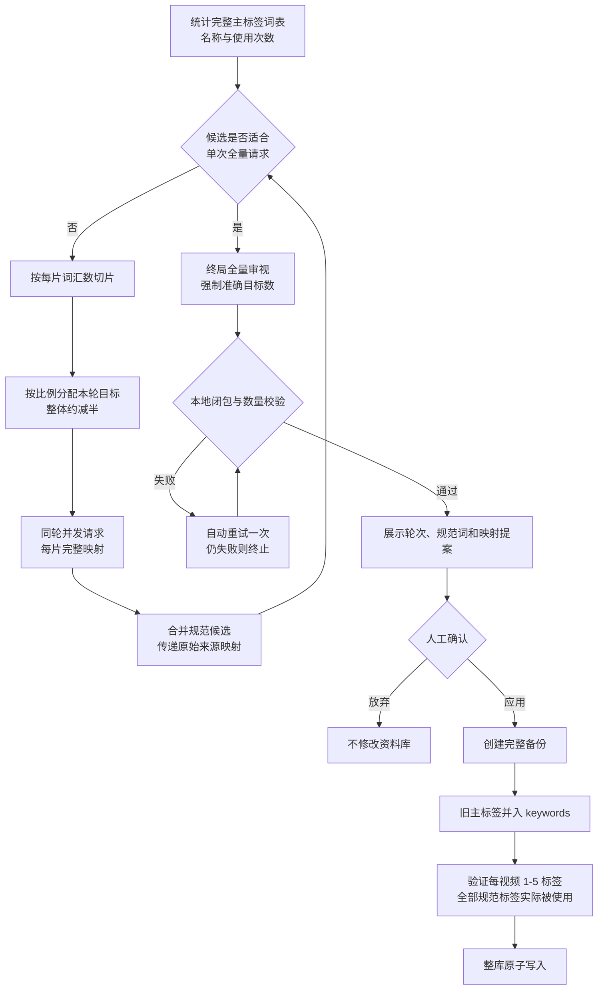

# Watchlater Atlas 受控标签统一规格

- 状态：已实施
- 规范版本：`watchlater-controlled-tags/v2`
- AI 策略：`ai-hierarchical-v1`
- 确定性迁移策略：`frequency-domain-v1`
- 适用数据契约：`bili-library/v2`

## 1. 目的

本规范用于把 AI 和人工长期积累的高基数标签，转换为适合人类浏览的受控主标签体系，同时完整保留可搜索的原始细节。

真实资料库曾出现以下状态：

| 指标 | 压缩前基线 |
| --- | ---: |
| 视频数 | 991 |
| 唯一主标签 | 1509 |
| 标签引用总数 | 4400 |
| 平均每个视频 | 4.44 |
| 只使用一次的标签 | 1039 |
| 使用不超过两次的占比 | 82.3% |

1500 个以上的平铺标签适合机器检索，不适合人类浏览。项目采用两层信息模型：

- `tags`：数量受控、面向导航和筛选的规范主标签。
- `keywords`：不设全库数量上限，保存人名、作品名、技术名、长尾描述和压缩前原词。

当前本地资料库为 989 条视频、200 个受控主标签。历史 1509 个标签仍保存在标签纪念册、数据库备份和各视频的 `keywords` 中。

## 2. 三种 AI 任务的边界

AI 分类窗口分成两个操作页，避免把完全不同的任务混在一条长表单中。

| 任务 | 输入 | 输出 | 是否保证最终数量 | 保存时机 |
| --- | --- | --- | --- | --- |
| 批量打标签 | 视频文本元数据和锁定词表 | 每条视频的标签、关键词、分类、主题和收藏夹建议 | 不改变锁定词表数量 | 每个成功批次立即保存 |
| 同义清洗 | 当前唯一标签及使用次数 | 只包含需要改名的 `from -> to` 映射 | 否 | 全部分片成功后整库保存一次 |
| 统一规格 | 当前唯一标签及使用次数 | 准确目标数量的 `canonicalTags` 和 100% 来源映射 | 是 | 先生成提案，确认后备份并原子写入 |

同义清洗不能替代统一规格。它适合处理 `AI / 人工智能`、缩写和全称、中英文、大小写、空格、字符损坏及明确近义名称。不同人物、作品、工具和话题并不是同义词，即使总量很多也不能靠同义判断硬删。

统一规格是带有明确数量预算的信息架构任务。它允许把低频细类归入稳定的中层或上层概念，但必须把原词保留到 `keywords`，不能永久丢失检索细节。

## 3. 数量与数据约束

- 默认最终目标为 200 个主标签。
- 界面允许 20-500 个目标标签。
- 目标不能大于当前唯一标签数；统一规格只归并，不凭空创造更多分类。
- 每个视频必须有 1-5 个主标签。
- 每个主标签必须存在于根级 `taxonomy.canonicalTags`。
- 每个最终规范标签必须至少被一个视频使用。
- 每个压缩前主标签必须保留在对应视频的 `keywords` 中。
- AI 返回的每个来源词必须恰好映射一次。
- 映射目标必须存在于本次返回的 `canonicalTags`。
- 任何校验失败都不能写入数据库。

目标数是信息架构预算，不代表所有语义天然可以无损合并。目标越小，主标签越偏向宽泛导航；具体实体和长尾描述更多依赖关键词搜索。

## 4. 分层收敛算法

统一规格不会把 1500 个标签和完整视频一次发送给模型。它采用近似二分的分层归合：

1. 统计当前全部唯一主标签及视频使用次数。
2. 按配置的每片词汇数切片，默认每片最多 500 个。
3. 每一轮把高于目标的候选总量大约减半。
4. 用比例配额把本轮输出预算分给各片；每片至少保留一个、不能超过本片输入数。
5. 同一轮的分片相互独立，可以按用户配置并发。
6. 下一轮只处理上一轮产生的规范候选，并汇总原始来源到当前候选的传递映射。
7. 候选数进入单请求安全范围后，必须执行一次包含全部候选词的终局全量审视。
8. 即使并行分片因为规范名重合而提前正好达到目标数，也仍要执行终局请求。
9. 终局请求必须返回准确目标数量，不能多也不能少。
10. 生成提案后停止写入，等待用户检查并点击“备份并应用”。



### 4.1 轮次示例

以 `1509 -> 200`、每片 500 为例，计划大致为：

| 轮次 | 输入候选 | 目标候选 | 请求形态 |
| ---: | ---: | ---: | --- |
| 1 | 1509 | 755 | 4 个切片请求，可同轮并发 |
| 2 | 755 | 378 | 2 个切片请求，可同轮并发 |
| 3 | 378 | 200 | 1 个终局全量请求 |

实际候选数可能因不同分片生成同名规范词而比计划更少。程序允许这种额外收敛，但不允许低于最终目标；达到目标后仍必须经过终局全量审视。

### 4.2 并发语义

并发只发生在同一轮。各片不需要实时交换结果，因为跨片一致性由后续轮次和终局请求解决。下一轮必须等待本轮所有分片成功并通过校验后才能开始。

并发数接受任意正整数，实际工作线程不会超过本轮分片数。数值过高仍可能触发第三方 API 的 429、RPM、TPM、连接数和预算限制。

## 5. 三种归并尺度

三种尺度都必须遵守最终数量，区别是遇到边界概念时保留多细。

| 尺度 | 判定原则 | 适用情况 | 主要风险 |
| --- | --- | --- | --- |
| 保守分层 | 尽量保留具体类别，只在达到目标所必需时归入上位概念 | 目标较宽松、重视细分浏览 | 可能形成较多边界接近的分类 |
| 均衡归类 | 合并同义、近义和过细子类，保留稳定中层概念 | 默认推荐，大多数个人资料库 | 少量细类需要依靠关键词搜索 |
| 强力收敛 | 优先形成更宽的导航入口，更多相关子主题归入上位概念 | 目标很小、主要依赖搜索 | 主标签信息粒度下降，需重点审查提案 |

模型不得因为数量目标把语义完全无关的词随意放在一起。使用次数越高的标签越应保留独立导航价值；低频专有名词可归入相关领域主标签，原词继续保留为关键词。

## 6. 三种同义判定

同义清洗不负责达到目标数，只统一命名。

| 判定 | 允许关系 | 示例 | 风险 |
| --- | --- | --- | --- |
| 严格同义 | 缩写、全称、中英文、大小写、空格、字符损坏、明确同义 | `LLM -> 大语言模型` | 最低 |
| 同义与无损近义 | 替换后基本不改变检索意图的近义名称 | `产品测评 -> 产品评测` | 中等 |
| 含安全上下位归并 | 明显过细且可安全归入上位概念的名称 | `歌曲翻唱 -> 翻唱` | 较高，需要人工检查 |

受控词表锁定后，同义清洗只允许把词表外历史别名收编到现有规范标签，不允许已经属于 `canonicalTags` 的规范词互相合并，以免日常命名清洗破坏已批准的数量预算。

## 7. AI 输出契约与校验

每个统一规格请求必须返回：

```json
{
  "canonicalTags": ["人工智能", "编程"],
  "tagMappings": [
    {
      "from": "AI",
      "to": "人工智能",
      "reason": "统一中英文名称"
    }
  ],
  "summary": "本片归并摘要"
}
```

本地程序按以下顺序验证：

1. Responses 优先使用严格 JSON Schema；兼容服务不支持时降级为 JSON Object。
2. 正文必须能通过 `JSON.parse`。
3. `canonicalTags` 去空、去重后必须恰好等于本请求目标数。
4. `tagMappings.from` 必须来自当前输入，且每个来源只能出现一次。
5. 每个输入来源必须全部出现，不能漏项。
6. 每个 `to` 必须存在于 `canonicalTags`。
7. 每个规范标签必须至少被一个映射使用。
8. 校验失败时使用更明确的纠错提示自动重试一次。
9. 两次都失败则整项任务失败，不生成可应用提案。
10. 所有轮次完成后，再校验原始来源到最终规范词的传递映射闭包。

程序保证结构和数据契约，不承诺模型的每个语义判断绝对正确。因此最终提案必须可见、可放弃，应用前必须备份。

## 8. 应用、备份与回滚

生成提案不会修改视频或 taxonomy。点击“备份并应用”后：

- 本地文件模式先创建 `data/backups/watchlater-before-ai-taxonomy-unification-<时间>.json`。
- 浏览器缓存模式先下载 `watchlater-browser-before-ai-taxonomy-<日期>.json` 快照。
- 当前每个视频的旧主标签全部并入 `keywords`。
- 新主标签按映射去重并限制为 1-5 个。
- 程序修复因单视频五标签限制而暂时没有实际引用的规范标签。
- 再次验证最终实际使用标签数等于目标数，且没有非法视频。
- 验证通过后整库写入一次；本地文件使用临时文件加重命名。

本地写入后的 taxonomy 示例：

```json
{
  "version": "watchlater-controlled-tags/v2",
  "strategy": "ai-hierarchical-v1",
  "requestedTargetCount": 200,
  "sourceUniqueTagCount": 1509,
  "finalUniqueTagCount": 200,
  "rounds": [
    {"round": 1, "inputCount": 1509, "outputCount": 755, "requests": 4}
  ],
  "canonicalTags": [
    {"name": "人工智能", "sourceUsageCount": 323, "finalVideoCount": 280}
  ],
  "sourceMappings": [
    {"source": "AI", "count": 120, "targets": ["人工智能"], "disposition": "canonical_and_keyword"}
  ]
}
```

`historicalSourceMappings` 会保留旧受控词表的历史来源映射，避免再次统一规格时丢失最初 1509 个标签的来历。

## 9. 浏览器缓存与本地文件

两种模式是独立副本，不自动同步：

- 本地文件：长期主资料库，写入 `data/watchlater.json` 和 `data/covers`。
- 浏览器缓存：写入当前站点 localStorage 的 `watchlater.items` 和 `watchlater.taxonomy`。

页面提供“清理缓存”，只删除上述两项浏览器视频数据，不删除本地文件、封面或 `watchlater.ai.config`。如果当前正在查看浏览器缓存，清理后自动切回本地文件。

“浏览器缓存包”导出会去掉 `coverFile`、封面哈希等只在本机服务有意义的字段，保留 `coverOriginal` CDN 地址，适合重新导入浏览器缓存模式。通用 JSON 则完整保留当前数据结构，适合备份和迁移本地资料库。

## 10. 确定性脚本与标签纪念册

AI 统一规格已经可在界面中完成。`tools/compress-tag-taxonomy.mjs` 仍保留为离线、确定性和可复现的迁移基线，适合没有 AI API、需要固定规则或需要复跑历史迁移的情况。

```powershell
# 导出当前完整标签纪念册
npm run export:tag-memory

# 只生成确定性压缩报告，不修改数据库
npm run compress:tags -- --target 200

# 创建完整备份后应用确定性压缩
npm run compress:tags -- --target 200 --apply
```

这些输出位于 `data/tag-archives` 和 `data/backups`，受 `.gitignore` 保护，不会推送到仓库。

## 11. 自动验收

项目包含隔离的端到端回归测试：

```powershell
npm run test:taxonomy
```

测试使用独立浏览器上下文和模拟 Responses 返回，不读取或修改真实 `data/watchlater.json`。它验证：

- 120 个来源标签按 `50 / 50 / 20` 分片。
- 第一轮分别归合为 `25 / 25 / 10`，得到 60 个候选。
- 第二轮使用一次全量请求准确归合为 20 个。
- 提案生成前浏览器缓存完全未写入。
- 应用时先下载快照。
- 最终 taxonomy 恰好 20 个规范标签。
- 每个视频有 1-5 个合法主标签。
- 原始标签全部保存在对应视频的 `keywords`。
- 浏览器缓存包保留 CDN 封面并去除本机 `coverFile`。
- 清空浏览器缓存会删除视频和 taxonomy，但保留 AI API 配置。

## 12. 验收标准

一次统一规格只有同时满足以下条件才能应用：

- 最终唯一主标签准确等于用户目标。
- 终局全量审视已经执行并通过。
- 每个来源标签存在且只存在一条最终映射。
- 所有映射目标都属于最终规范词表。
- 每个最终规范标签都被至少一个视频实际使用。
- 每个视频有 1-5 个主标签。
- 原始标签全部进入对应视频的 `keywords`。
- 根级 taxonomy、轮次记录、模型、生成时间和来源映射完整。
- 本地文件模式的应用前数据库备份写入成功，或浏览器缓存模式的快照已下载。
- 搜索能够通过 `keywords` 找到不再显示于标签云的长尾词。
- 任何请求、解析、映射或最终验证失败时，资料库保持应用前状态。
