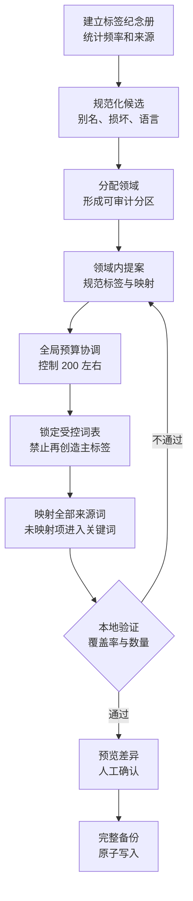

# Watchlater Atlas 受控标签压缩规范

- 状态：已实施
- 规范版本：`watchlater-controlled-tags/v1`
- 基线算法：`frequency-domain-v1`
- 适用数据契约：`bili-library/v2`

## 1. 目的

本规范用于把 AI 和人工长期积累的高基数标签，转换为适合人类浏览的受控标签体系，同时完整保留原始细节。

当前真实资料库的压缩前测量结果为：

| 指标 | 数值 |
| --- | ---: |
| 视频数 | 991 |
| 唯一标签 | 1509 |
| 标签引用总数 | 4400 |
| 平均每个视频 | 4.44 |
| 仅使用一次的标签 | 1039 |
| 仅使用两次的标签 | 203 |
| 使用不超过两次的占比 | 82.3% |

这种长尾分布适合全文检索，不适合在主界面展示为平铺筛选器。项目采用两层信息模型解决该问题：

- `tags`：数量受控、面向人类导航和筛选的规范标签。
- `keywords`：不设全库数量上限、面向检索和细节保存的长尾关键词。

## 2. 数量目标

默认目标为 200 个主标签。

- 推荐区间：180-220。
- 可配置区间：200-300。
- 单个视频最多保留 5 个主标签。
- 单个视频必须至少有 1 个主标签。
- 压缩不能通过永久删除原标签实现。

数量目标是信息架构预算，不是要求 AI 猜测哪些词看起来相似。主标签必须覆盖资料库的主要领域、内容形态和常用检索入口；人名、作品名、软件名、具体技术名及低频描述通常进入 `keywords`。

## 3. 为什么同义归核不能完成数量压缩

同义归核只适合处理以下关系：

- 大小写和空格差异；
- 中英文名称差异；
- 缩写和全称；
- 字符损坏；
- 明确同义且替换后不损失检索意图的名称。

如果 1509 个词中大部分本来就是不同的人名、作品、工具、技术或话题，同义归核必须原样保留它们。遗漏映射也会被本地程序原样保留。因此，同义归核可以清洗命名，却不能可靠地实现 `1509 -> 200` 的数量预算。

项目中的 AI 按钮已经明确命名为“同义归核”。它不再承诺把标签减少到目标数量。真正的目标压缩使用本规范和确定性脚本完成。

受控词表锁定后，同义归核只允许把词表外的历史别名映射到现有规范标签。已经属于 `canonicalTags` 的名称不能再映射到另一个规范标签，避免日常命名清洗破坏已批准的数量预算和分类边界。

## 4. 数据契约

### 4.1 视频字段

```json
{
  "id": "BV1xxxxxxxxx",
  "tags": ["人工智能", "编程"],
  "keywords": ["Claude Code", "MCP", "原始长尾标签"],
  "category": "科技",
  "topics": [],
  "collections": []
}
```

约束：

- `tags` 中每个值必须存在于根级 `taxonomy.canonicalTags`。
- `keywords` 可以包含原始标签、AI 提取的实体和人工关键词。
- `keywords` 参与搜索，但不进入主标签云。
- 同一个词可以同时存在于 `tags` 和 `keywords`；这有利于保留来源信息和回滚。
- 后续 AI 分类不得创造新的主标签。无法放入受控词表的细节必须写入 `keywords`。
- 人工编辑输入的词表外主标签必须自动转存为 `keywords`；若没有合法主标签，则使用受控词“综合”兜底。

### 4.2 根级 taxonomy

```json
{
  "taxonomy": {
    "version": "watchlater-controlled-tags/v1",
    "strategy": "frequency-domain-v1",
    "generatedAt": "2026-07-22T00:00:00.000Z",
    "requestedTargetCount": 200,
    "sourceUniqueTagCount": 1509,
    "finalUniqueTagCount": 200,
    "canonicalTags": [
      {
        "name": "人工智能",
        "sourceUsageCount": 323,
        "finalVideoCount": 323
      }
    ],
    "sourceMappings": [
      {
        "source": "Claude Code 教程",
        "count": 1,
        "targets": ["Claude Code", "教程"],
        "disposition": "canonical_and_keyword"
      }
    ]
  }
}
```

根级 `taxonomy` 是资料库契约的一部分。普通编辑、AI 写回、封面补全、JSON 导入导出和 BiliStar 导出都必须保留它。

## 5. 当前确定性算法

`tools/compress-tag-taxonomy.mjs` 实现 `frequency-domain-v1`：

1. 统计所有原始标签的使用次数。
2. 对明确别名执行固定规范化，例如 `AI -> 人工智能`、`LLM -> 大模型`。
3. 强制保留主要领域入口，例如人工智能、编程、学习、游戏、音乐、设计、健康和生活。
4. 按实际使用频率补足规范词表，直到目标数量。
5. 使用精确别名、包含关系、领域规则、主分类、主题、收藏夹和标题上下文为每个视频选择 1-5 个主标签。
6. 把每个视频压缩前的全部标签并入 `keywords`。
7. 验证输出标签全部属于锁定词表，并验证每个原始标签都仍存在于对应视频的 `keywords`。
8. 只有使用 `--apply` 时才覆盖数据库；覆盖前创建完整备份。

该算法对同一份未压缩快照会产生可复现结果，并且全过程可审计，不依赖一次不可复现的大模型响应。它是当前迁移的稳定基线，不代表未来不能引入更高质量的 AI 提案阶段。

## 6. 未来 AI 压缩设计

未来的 AI 目标压缩应采用多阶段工作流，不应让模型在一次请求中直接改写整库：



阶段要求：

1. 规范化：只处理明确别名，不执行领域压缩。
2. 领域分配：为所有来源词指定一个或多个领域，避免不同语境误合并。
3. 领域提案：每个领域独立提出规范词和来源映射。
4. 全局预算协调：按覆盖率、频率、区分价值和领域配额控制总数。
5. 词表锁定：生成最终规范词后，后续步骤不得增加新主标签。
6. 全量映射：100% 的来源词必须有明确处置，即映射为主标签，或标记为 `keyword_only`。
7. 审计预览：应用前显示新增、删除、映射、无主标签视频和预期数量。

## 7. 标签纪念册、备份和回滚

压缩前先导出标签纪念册：

```powershell
npm run export:tag-memory
```

输出到：

```text
data/tag-archives/tag-memory-<时间>-<标签数>-tags.json
data/tag-archives/tag-memory-<时间>-<标签数>-tags.md
```

压缩预演：

```powershell
npm run compress:tags -- --target 200
```

正式应用：

```powershell
npm run compress:tags -- --target 200 --apply
```

正式应用会额外创建：

```text
data/backups/watchlater-before-tag-compression-<时间>.json
data/tag-archives/tag-compression-<时间>-<压缩前>-to-<压缩后>.json
```

这些文件受 `.gitignore` 保护，只保存在本机。回滚时停止本地服务，把所需备份复制为 `data/watchlater.json`，再重新启动项目。

## 8. 验收标准

一次压缩只有同时满足以下条件才能应用：

- 最终唯一主标签不超过请求目标。
- 最终唯一主标签处于约定区间；本次目标为 200。
- 每个视频有 1-5 个主标签。
- 所有主标签都存在于 `taxonomy.canonicalTags`。
- 压缩前每个视频的全部原始标签都存在于压缩后的 `keywords`。
- 根级 `taxonomy`、来源映射、生成时间和策略版本完整。
- 压缩报告写入成功。
- 正式覆盖前的完整数据库备份写入成功。
- 搜索能够通过 `keywords` 找到不再显示于主标签云的长尾词。
- 后续编辑、AI 分类和封面任务不会删除 `keywords` 或根级 `taxonomy`。

## 9. 本次迁移结果

本次真实资料库使用目标 200 执行迁移：

```text
视频：991
唯一主标签：1509 -> 200
减少：1309
原始标签关键词覆盖率：100%
无主标签视频：0
```

主界面只展示约 200 个受控标签。1509 个历史标签仍通过标签纪念册、完整数据库备份和每条视频的 `keywords` 保存，可继续搜索，也可用于未来重新生成不同规模的词表。
